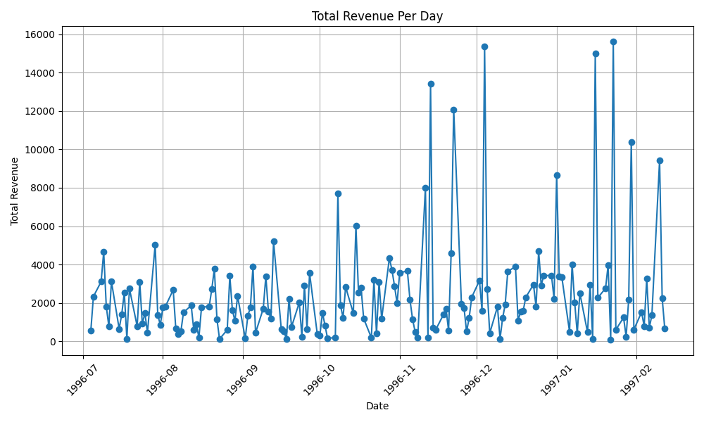

# ETL Pipeline with Apache Airflow, PostgreSQL & Python

A complete, end-to-end **ETL (Extract, Transform, Load) pipeline** that pulls sales data from a PostgreSQL database, transforms it with Pandas, and produces daily revenue reports and visualizations — all orchestrated with Apache Airflow.



## Overview

The pipeline runs three tasks in sequence:

| Step | Task | What it does |
|------|------|--------------|
| 1️⃣ Extract | `fetch_order_data` | Connects to PostgreSQL via Airflow's `PostgresHook`, joins the `orders`, `order_details`, and `products` tables, and exports the raw sales data |
| 2️⃣ Transform | `calculating_daily_revenue` | Computes total revenue per day (`price × quantity`, grouped by sale date) with Pandas |
| 3️⃣ Load / Report | `visualizing_revenue_per_day` | Generates a time-series chart of daily revenue with Matplotlib |

## Architecture

```
PostgreSQL ──► Airflow DAG (PostgresHook)
                   │
                   ├── sales_data.csv             (extracted order details)
                   ├── Revenue_Per_Day.csv        (aggregated daily revenue)
                   └── Total_Revenue_Per_Day.png  (visualization)
```

## Project Structure

```
├── dags/
│   └── Airflow_Assignment.py   # Airflow DAG: extract → transform → visualize
├── data/
│   ├── orders.csv              # Source table: orders
│   ├── order_details.csv       # Source table: order line items
│   └── products.csv            # Source table: product catalog
├── outputs/                    # Sample pipeline outputs
│   ├── sales_data.csv
│   ├── Revenue_Per_Day.csv
│   └── Total_Revenue_Per_Day.png
└── requirements.txt
```

> The `data/` folder contains the CSVs used to seed the PostgreSQL source tables. The `outputs/` folder holds sample results from a full pipeline run.

## Tech Stack

- **Apache Airflow** — orchestration and scheduling
- **PostgreSQL** — source database
- **Python / Pandas** — data processing and transformation
- **Matplotlib** — visualization

## Getting Started

1. **Install dependencies**

   ```bash
   pip install -r requirements.txt
   ```

2. **Load the source data** — create the `orders`, `order_details`, and `products` tables in PostgreSQL from the CSVs in `data/`.

3. **Configure the Airflow connection** — create a Postgres connection in Airflow with the ID `postgres_conn` (Admin → Connections in the Airflow UI).

4. **Deploy the DAG** — copy `dags/Airflow_Assignment.py` into your Airflow `dags/` folder, then update the output paths inside the DAG to a directory of your choice.

5. **Run it** — enable and trigger the `daily_sales_revenue_analysis` DAG from the Airflow UI. Results land in your configured outputs directory.

## Sample Output

- `sales_data.csv` — order-level detail: sale date, product, quantity, price
- `Revenue_Per_Day.csv` — total revenue aggregated per day
- `Total_Revenue_Per_Day.png` — daily revenue trend chart (shown above)

## License

Released under the [MIT License](LICENSE).
